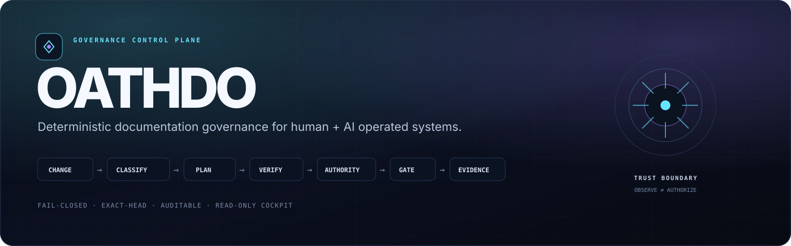

<div align="center">



# OATHDO

### Deterministic documentation governance for human + AI operated systems

**Detect impact. Plan controlled change. Verify policy. Bind authority. Preserve evidence.**

[](https://github.com/eimyroot/OATHDO/actions/workflows/quality.yml)
[](https://scorecard.dev/viewer/?uri=github.com/eimyroot/OATHDO)

[](LICENSE)

</div>

---

## What is OATHDO?

**OATHDO** is an open-source governance framework for technical documentation and repository change control. It connects repository changes with the documentation, decisions, approvals, policy checks, and audit evidence that should accompany them.

Its deterministic core can:

- classify the impact of changed files and Git diffs;
- evaluate a versioned decision matrix;
- produce explainable documentation-operation plans;
- validate metadata, relationships, supersession, and local links;
- enforce approval and authority boundaries where policy requires them;
- publish a GitHub governance gate;
- preserve an auditable trail of decisions and evidence.

> [!NOTE]
> The product and repository are named **OATHDO**. The Python package and compatibility CLI remain named `goverdocs` in the current release line. Renaming those interfaces would be a separate breaking-change migration.

## Local cockpit

OATHDO includes a **read-only local operator cockpit**. It observes repository and governance-control-plane state without exposing write, approval, merge, token, or bypass capability.

```bash
git clone https://github.com/eimyroot/OATHDO.git
cd OATHDO
./RUN_COCKPIT.command
```

Default endpoint:

```text
http://127.0.0.1:8765/
```

Headless / terminal-only check:

```bash
python3 scripts/cockpit.py --root . --check
```

Security boundary:

- loopback-only by default;
- non-loopback binding is refused unless `--allow-remote` is explicit;
- HTTP surface is read-only;
- no credentials or GitHub mutation APIs are exposed;
- canonical truth remains repository files, Git history, policies, and evidence.

## Control loop

```text
Repository change
      │
      ▼
Deterministic classification
      │
      ▼
Decision matrix
      │
      ▼
Operation plan
      │
      ▼
Validation + evidence
      │
      ▼
Exact-subject / exact-head authority
      │
      ▼
GOVERDOCS Governance Gate
      │
      ▼
GitHub server enforcement
```

## Current status

OATHDO is an **alpha-stage governance system** with a substantial tested kernel, repository-level CI/security controls, explicit authority policy, and an active required governance gate on `main`.

The repository intentionally does **not** equate a green badge with broad production readiness. Canonical milestone and verification state live in [`PROJECT_STATE.md`](PROJECT_STATE.md) and the governed evidence under [`docs/governance/`](docs/governance/).

Known compatibility boundary: `GOVERDOCS Governance Gate` remains the required GitHub check context. Renaming that identifier must be a coordinated workflow + ruleset migration to avoid a protection gap.

## Architecture

```text
                         OATHDO
                           │
              ┌────────────┴────────────┐
              │                         │
      Deterministic kernel        Operator surfaces
       src/goverdocs/*              cockpit/*
              │                         │
              ├─ classifier             └─ read-only local status
              ├─ decision policy
              ├─ planner
              ├─ validator
              ├─ authority
              ├─ evidence
              └─ GitHub adapters
              │
              ▼
     policies / manifests / schemas
              │
              ▼
      GitHub governance enforcement
```

The cockpit is deliberately kept outside the kernel package. Presentation and observability must not silently become an authorization path.

## Quick start

### Requirements

- Python 3.11, 3.12, or 3.13;
- Git;
- POSIX shell for the bootstrap helper.

```bash
git clone https://github.com/eimyroot/OATHDO.git
cd OATHDO
./scripts/bootstrap_local.sh
.venv/bin/goverdocs --version
.venv/bin/goverdocs health --root .
```

Basic governance workflow:

```bash
.venv/bin/goverdocs inspect --root .
.venv/bin/goverdocs classify --root . --diff HEAD~1..HEAD
.venv/bin/goverdocs plan --root . --diff HEAD~1..HEAD
.venv/bin/goverdocs validate --root . --receipt
.venv/bin/goverdocs health --root . --receipt
```

## Repository map

| Path | Responsibility |
|---|---|
| `src/goverdocs/` | Deterministic governance kernel and GitHub adapters |
| `automation/` | Decision matrix and documentation policy |
| `policies/` | Authority and change-gate policy |
| `schemas/` | Public governance/evidence schemas |
| `manifests/` | Derived document registry and relationship graph |
| `docs/` | Canonical architecture, decisions, governance, operations, reviews |
| `evidence/` | Baselines and local receipt boundary |
| `cockpit/` | Read-only operator UI |
| `scripts/` | Bootstrap, verification, distribution, and cockpit helpers |
| `tests/` | Contract, unit, enforcement, packaging, and security tests |
| `site-docs/` | Derived documentation portal source |

## Verification

```bash
./scripts/bootstrap_local.sh
./scripts/verify.sh
python3 scripts/cockpit.py --root . --check
```

The standard verification path runs linting, static typing, tests, documentation validation, and health checks. CI additionally verifies the release/distribution path.

## Security principles

- fail closed;
- exact-subject / exact-head approvals where required;
- no self-approval for critical changes;
- no weakening of repository enforcement to make a test pass;
- no fabricated authority actors;
- least privilege and explicit capability boundaries;
- missing or unverifiable evidence must never be silently upgraded to success;
- LLM-generated proposals are not equivalent to human authority.

See [`SECURITY.md`](SECURITY.md) for vulnerability reporting.

## Documentation

- [`PROJECT_STATE.md`](PROJECT_STATE.md) — canonical project state;
- [`DOCUMENTATION_INDEX.md`](DOCUMENTATION_INDEX.md) — governed documentation index;
- [`docs/architecture/`](docs/architecture/) — system architecture;
- [`docs/governance/`](docs/governance/) — governance model and evidence;
- [`policies/`](policies/) — policy and enforcement contracts;
- [`site-docs/`](site-docs/) — documentation portal source;
- [`CONTRIBUTING.md`](CONTRIBUTING.md) — contribution contract.

## License

Apache-2.0. See [`LICENSE`](LICENSE).
